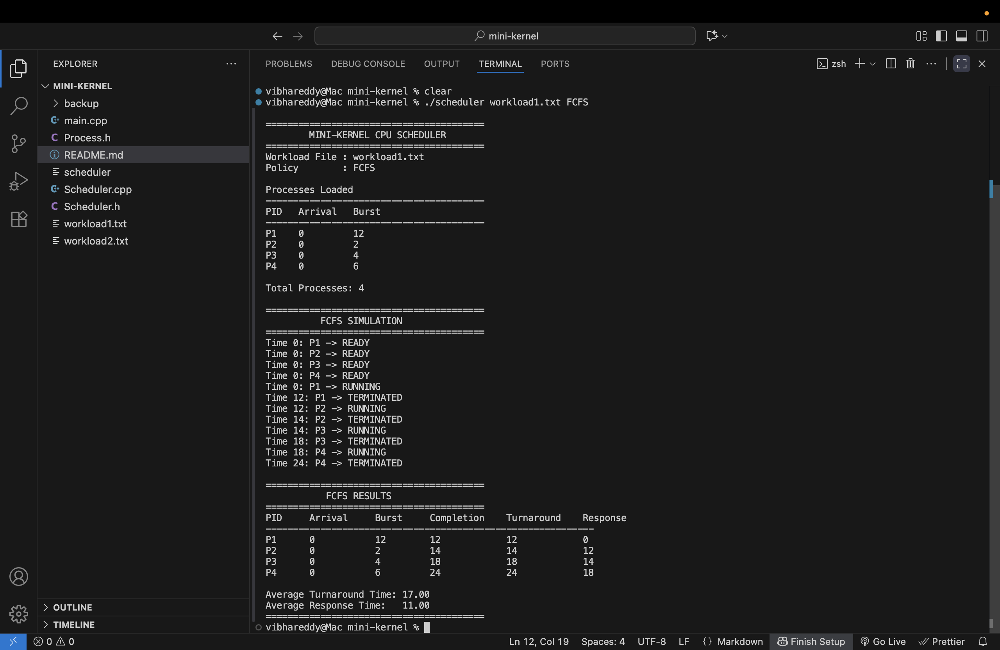
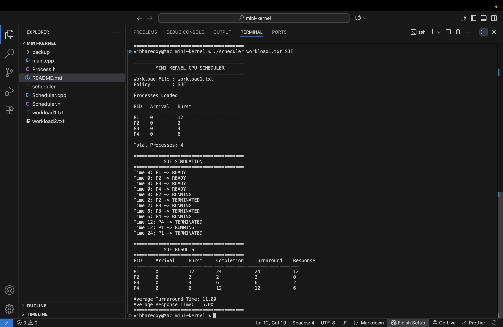
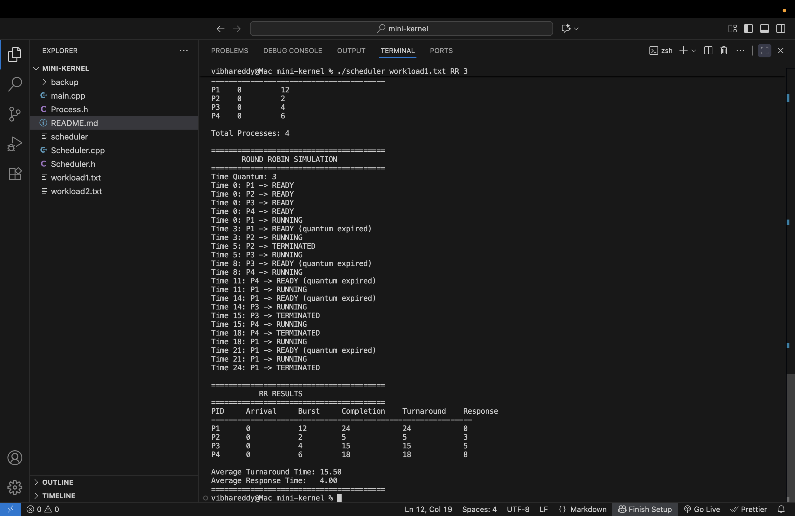
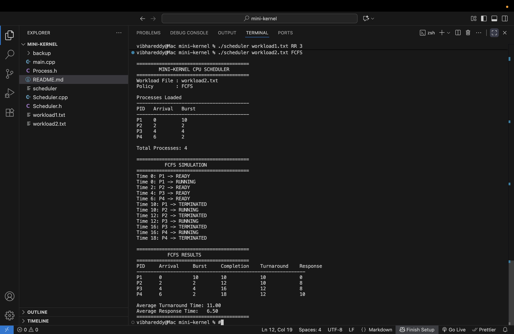
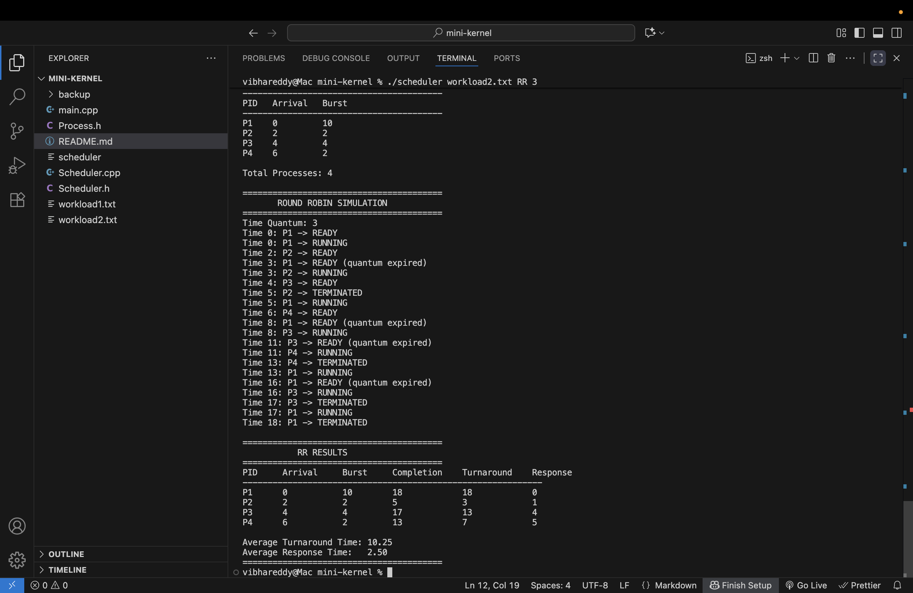

# Mini-Kernel CPU Scheduler

## Overview

This project implements a simple CPU scheduling simulator in C++.

The simulator reads process information from a workload file and supports
three CPU scheduling policies:

- First-Come, First-Served (FCFS)
- Shortest Job First (SJF)
- Round Robin (RR)

The simulator maintains process states, a simulated CPU clock, a ready queue,
and calculates scheduling performance metrics.

## Files

- `main.cpp` - Loads the workload file, handles command-line arguments, and starts the selected scheduling policy.
- `Process.h` - Defines the process structure and process states.
- `Scheduler.h` - Contains the Scheduler class declarations.
- `Scheduler.cpp` - Implements FCFS, SJF, and Round Robin scheduling.
- `workload1.txt` - Contains the first process workload.
- `workload2.txt` - Contains the second process workload.

## Compilation

Compile the project using:

```bash
g++ -std=c++17 -Wall -Wextra -o scheduler main.cpp Scheduler.cpp
```

If compilation is successful, an executable named `scheduler` will be created.

## Running the Program

The general command format is:

```bash
./scheduler <workload-file> <policy>
```

For Round Robin:

```bash
./scheduler <workload-file> RR <quantum>
```

## FCFS

Run FCFS using:

```bash
./scheduler workload1.txt FCFS
```

or:

```bash
./scheduler workload2.txt FCFS
```

FCFS selects processes in the order in which they enter the ready queue.

Once a process starts running, it continues until completion.

## SJF

Run SJF using:

```bash
./scheduler workload1.txt SJF
```

or:

```bash
./scheduler workload2.txt SJF
```

SJF selects the ready process with the shortest CPU burst.

This implementation uses non-preemptive SJF. Therefore, once a process
starts running, it continues until it completes.

## Round Robin

Run Round Robin using:

```bash
./scheduler workload1.txt RR 3
```

or:

```bash
./scheduler workload2.txt RR 3
```

The last argument specifies the time quantum.

For example, with a quantum of `3`, a process can execute for at most
three simulated CPU time units before being returned to the ready queue,
if it has remaining CPU time.

## Workload Format

Each workload file contains three values for each process:

```text
PID ArrivalTime BurstTime
```

### Workload 1

```text
1 0 12
2 0 2
3 0 4
4 0 6
```

All processes arrive at time `0`.

### Workload 2

```text
1 0 10
2 2 2
3 4 4
4 6 2
```

The processes arrive at different times.

## Required Runs

The scheduler can be tested using the following commands.

### Workload 1

```bash
./scheduler workload1.txt FCFS
./scheduler workload1.txt SJF
./scheduler workload1.txt RR 3
```

### Workload 2

```bash
./scheduler workload2.txt FCFS
./scheduler workload2.txt SJF
./scheduler workload2.txt RR 3
```

## Output

For each simulation, the program displays:

- Process arrival and burst information
- Process state changes
- CPU execution order
- Completion time
- Turnaround time
- Response time
- Average turnaround time
- Average response time

## Performance Metrics

### Turnaround Time

```text
Turnaround Time = Completion Time - Arrival Time
```

### Response Time

```text
Response Time = First Run Time - Arrival Time
```

Response time represents how long a process waits before receiving CPU
time for the first time.

## Scheduling Policies

### FCFS

Processes are executed in ready-queue order.

### SJF

The ready process with the shortest burst time is selected.

This implementation uses non-preemptive SJF.

### Round Robin

Processes share the CPU using a fixed time quantum. A process that uses
its quantum and still has remaining CPU time is returned to the ready queue.

## Notes

- Processes are loaded from workload files.
- The scheduling policy is selected through the command line.
- The Round Robin quantum is supplied through the command line.
- The scheduler supports processes with different arrival times.
- The CPU clock is simulated rather than using real-time execution.


## Results

The scheduler was tested using both workload files and all three scheduling policies.

### Workload 1

#### FCFS



#### SJF



#### Round Robin



### Workload 2

#### FCFS



#### SJF


#### Round Robin

